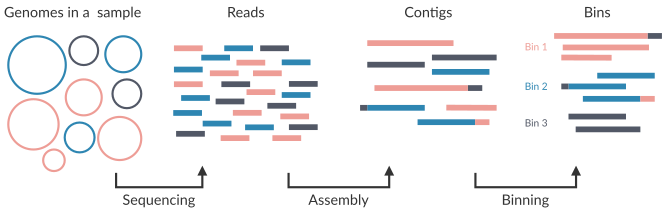

<div class="mt-10">

  **Diego Alvarez S. | [<carbon-logo-github class="inline-block w-4 h-4 mb-0.75" /> dialvarezs](https://github.com/dialvarezs)**

</div>

<div class="mt-12">

10.12.2025

</div>

<!--
-->

---
transition: slide-left
---

# Table of Contents

1. Background of metagenomic analysis
2. Challenges when working with metagenomics
3. How to configure and use nf-core/mag
4. nf-core/mag output and how to use it


---
layout: section
transition: slide-left
---

# Metagenomic Analysis

---
transition: slide-left
---

# What is metagenomics?

Metagenomics is the study of the structure and function of <span class="text-accent">entire nucleotide sequences isolated and analyzed from all the organisms (typically microbes) in a bulk sample</span>.
Metagenomics is often used to study a specific community of microorganisms, such as those residing on human skin, in the soil or in a water sample.

---
transition: slide-left
---

# Metagenome Assembly & Binning

<div class="mt-24 flex justify-center">

</div>

<!--
-->

---
layout: full
transition: slide-left
---

# Current Workflow (v5.3)

<div class="mt--15 flex justify-center">

</div>

<!--
-->

---
layout: full
transition: slide-left
---

# nf-core/mag v5.1 - Preprocessing

<div class="flex items-center justify-center h-full">
  <div style="width: 75%; height: 420px; overflow: hidden; position: relative;">
    
  </div>
</div>

<!--
-->

---
layout: full
transition: slide-left
---

# nf-core/mag v5.1 - Assembly and Annotation

<div class="flex items-center justify-center h-full">
  <div style="width: 90%; height: 310px; overflow: hidden; position: relative;">
    
  </div>
</div>

<!--
-->

---
layout: full
transition: slide-left
---

# nf-core/mag v5.1 - Binning and Refinement

<div class="flex items-center justify-center h-full">
  <div style="width: 80%; height: 300px; overflow: hidden; position: relative;">
    
  </div>
</div>

<!--
-->

---
layout: full
transition: slide-left
---

# nf-core/mag v5.1 - Bin QC and Taxonomy

<div class="flex items-center justify-center h-full">
  <div style="width: 27%; height: 450px; overflow: hidden; position: relative;">
    
  </div>
</div>

<!--
-->

---
transition: slide-left
---

# How to run nf-core/mag v5.1.0?

```bash
nextflow run nf-core/mag -r 5.1.0 \
  -profile <docker/singularity/.../institute> \
  --input samplesheet.csv \
  --outdir results/
```

Mixed short + long read samplesheet

```csv
sample,group,short_reads_1,short_reads_2,long_reads,short_reads_platform,long_reads_platform
sample1,0,data/sample1_R1.fastq.gz,data/sample1_R2.fastq.gz,data/sample1.fastq.gz,ILLUMINA,OXFORD_NANOPORE
sample2,0,data/sample2_R1.fastq.gz,data/sample2_R2.fastq.gz,data/sample2.fastq.gz,ILLUMINA,OXFORD_NANOPORE
sample3,1,data/sample3_R1.fastq.gz,data/sample3_R2.fastq.gz,,ILLUMINA,
```

Long read only, merging runs
```csv
sample,run,group,long_reads,long_reads_platform
sample1,1,0,data/sample1a.fastq.gz,OXFORD_NANOPORE
sample1,2,0,data/sample1b.fastq.gz,OXFORD_NANOPORE
sample2,0,0,data/sample2.fastq.gz,OXFORD_NANOPORE
sample3,1,0,data/sample3.fastq.gz,OXFORD_NANOPORE
```

<!--
-->

---
transition: slide-left
---

# Cleanup

Before moving to the next session, let's ensure we have sufficient space on your VM's storage for the next pipeline

```bash
# Remove files generated by nf-core/mag
rm -fr /vol/volume/sessions/nf-core_mag/{output,work,.nextflow*}

# Clean docker volumes
docker volumes prune -af
```

<style>
.slidev-layout pre {
  font-size: 0.9em !important;
}
</style>


---
layout: center
class: text-center
---

<div>

</div>

# Thank you!

<div class="mt-12 space-y-8">

<div class="text-xl opacity-80">
Questions? Suggestions? Issues?
</div>

<div class="flex justify-center gap-12 text-lg">

<div>
<carbon-logo-github class="text-4xl mb-2" />
<div class="font-bold">GitHub</div>
<a href="https://github.com/nf-core/mag" target="_blank" class="text-teal-600 dark:text-teal-400 hover:underline">nf-core/mag</a>
</div>

<div>
<carbon-chat class="text-4xl mb-2" />
<div class="font-bold">Slack</div>
<a href="https://nfcore.slack.com/channels/mag" target="_blank" class="text-teal-600 dark:text-teal-400 hover:underline">#mag</a>
</div>

<div>
<carbon-document class="text-4xl mb-2" />
<div class="font-bold">Documentation</div>
<a href="https://nf-co.re/mag" target="_blank" class="text-teal-600 dark:text-teal-400 hover:underline">nf-co.re/mag</a>
</div>

</div>

</div>
