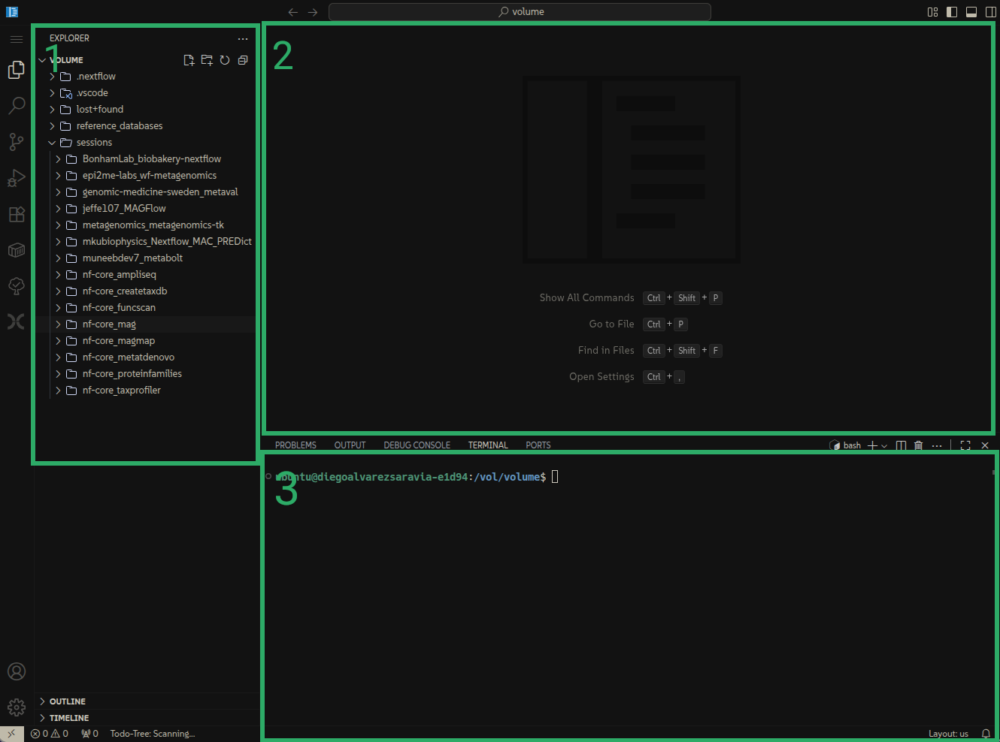
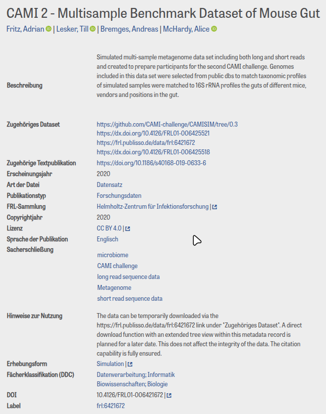
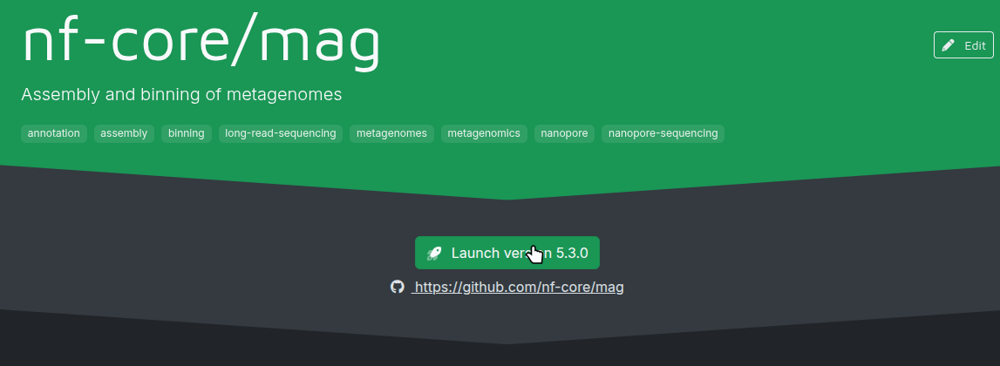

<div>

  **Diego Alvarez S. | [<carbon-logo-github class="inline-block w-4 h-4 mb-0.75" /> dialvarezs](https://github.com/dialvarezs)**

</div>

<div class="mt-12">

10.12.2025

</div>

<!--
-->

---
transition: slide-left
---

# Overview

<div class="toc-grid mt-12">

<div class="toc-item">
  <div class="toc-number">01</div>
  <div class="toc-title">Metagenomic analysis background</div>
</div>

<div class="toc-item">
  <div class="toc-number">02</div>
  <div class="toc-title">Why should you use nf-core/mag?</div>
</div>

<div class="toc-item">
  <div class="toc-number">03</div>
  <div class="toc-title">How to configure and use nf-core/mag</div>
</div>

<div class="toc-item">
  <div class="toc-number">04</div>
  <div class="toc-title">nf-core/mag output and how to use it</div>
</div>

</div>

<style>
.toc-grid {
  display: grid;
  grid-template-columns: 1fr;
  gap: 1.5rem;
  max-width: 600px;
  margin: 0 auto;
}

.toc-item {
  display: flex;
  align-items: center;
  gap: 1.5rem;
  padding: 1.5rem;
  background: rgba(45, 170, 102, 0.05);
  border: 2px solid rgba(45, 170, 102, 0.2);
  border-radius: 12px;
}

.dark .toc-item {
  background: rgba(45, 170, 102, 0.08);
  border-color: rgba(45, 170, 102, 0.25);
}

.toc-number {
  font-size: 1.3rem;
  font-weight: 300;
  color: #2dab67;
  opacity: 0.6;
  line-height: 1;
  flex-shrink: 0;
}

.toc-title {
  font-size: 1.1rem;
  font-weight: 500;
  line-height: 1.4;
  color: inherit;
}
</style>


---
layout: section
transition: slide-left
---

# Metagenomic Analysis

---
transition: slide-left
---

# What is metagenomics?

Metagenomics is the study of the structure and function of <span class="text-accent">entire nucleotide sequences isolated and analyzed from all the organisms (typically microbes) in a bulk sample</span>.

Metagenomics is often used to study a specific community of microorganisms, such as those residing on human skin, in the soil or in a water sample.

<p class="text-xs text-gray">
https://www.genome.gov/genetics-glossary/Metagenomics
</p>

---
transition: slide-left
---

# Why metagenomics?

<div class="grid grid-cols-2 gap-8 mt-8">

<div>

### Traditional microbiology limitations

- Only ~1% of microbes are culturable
- Slow and labor-intensive
- Misses complex interactions
- Biased towards abundant species

</div>

<div>

### Metagenomics enables

- Culture-independent analysis
- Study entire communities
- Discover novel organisms
- Understand functional potential
- Analyze unculturable microbes

</div>

</div>

---
transition: slide-left
---

# Shotgun metagenomics approaches

<div class="grid grid-cols-2 gap-8 mt-12">

<div>

### Read-based profiling

**Direct classification of reads against reference databases (Kraken, MetaPhlAn)**

- Fast taxonomic and functional profiling
- Limited to known organisms

</div>

<div>

### Assembly-based (MAGs) 

**Genome reconstruction from metagenomic data**

- Recover novel organisms
- Complete metabolic pathways
- Strain-level resolution
- Enables comparative genomics

</div>

</div>

---
transition: slide-left
---

# Shotgun metagenomics workflow

<div class="mt-24 flex justify-center">

</div>

---
transition: slide-left
---

# What are MAGs?

<div class="mt-8">

## Metagenome-Assembled Genomes (MAGs)

Individual <span class="text-accent">draft genomes reconstructed from metagenomic data</span> by grouping (binning) assembled sequences that likely originated from the same organism.

<div class="mt-8"></div>

### What can you discover from MAGs?

- **Taxonomy**: Identify novel species and strains
- **Metabolic potential**: Predict functional capabilities
- **Evolutionary insights**: Understand microbial evolution
- **Biosynthetic pathways**: Discover new enzymes and compounds
- **Ecological roles**: Understand community interactions
- **Comparative genomics**: Study population-level variation

</div>

---
transition: slide-left
---

# Metagenomics analysis is complex

<div class="grid grid-cols-2 gap-12 mt-8">

<div>

### Computational complexity
- Massive datasets (100s of GB)
- High memory and CPU requirements

<div class="mt-6"></div>

### Workflow complexity
- Many tools with different requirements
- Which tools and parameters to use?
- How to integrate them together?
- Ensuring reproducibility

</div>

<div>

### Biological complexity
- Uneven species abundance
- Strain variation within species
- Horizontal gene transfer
- Repetitive sequences

<div class="mt-8"></div>

### Technical challenges
- Contamination (host, reagents)
- Sequencing errors and biases
- Incomplete assemblies
- Chimeric contigs

</div>

</div>

---
transition: slide-left
---

# The solution: Standardized workflows

<div class="mt-8">

Pipelines <span class="text-accent">simplify the workflow</span>, allowing you to focus on biological questions

<div class="mt-10"></div>

### Benefits of established pipelines

- **Reproducibility**: Consistent results across studies
- **Best practices**: Incorporates validated methods and tools
- **Efficiency**: Optimized resource management and parallelization
- **Quality control**: Built-in validation and error checking
- **Community support**: Well-documented and actively maintained

</div>

---
layout: section
transition: slide-left
---

# nf-core/mag

---
transition: slide-left
---

# nf-core/mag

<div class="grid grid-cols-2 gap-12 mt-8">

<div>


**Best-practice pipeline for assembly and binning of metagenomes**

Built with Nextflow, part of the nf-core community

</div>

<div>

### Key features

**Flexible input**
- Short reads, long reads, or hybrid
- Start from raw reads or assembled contigs

**Comprehensive analysis**
- Quality control and preprocessing
- Assembly and binning
- MAG refinement and quality assessment
- Taxonomic classification and annotation

</div>

</div>

---
layout: full
transition: slide-left
---

# nf-core/mag v5.3 workflow

<div class="mt--18 flex justify-center">

</div>

<!--
-->

---
layout: section
transition: slide-left
---

# Practical Session

---
transition: slide-left
---

# Computational environment setup

## To start

- Please <span class="text-accent">open the link</span> of your personal deNBI VM
- Login with your credentials
- You should see a VS Code interface

## Recommended

- Open the nf-core/mag documentation in another tab: https://nf-co.re/mag

---
transition: slide-left
---

# VS Code interface

<div class="grid gap-8 mt-8" style="grid-template-columns: 2fr 1fr;">

<div>



</div>

<div class="flex items-center">

<div>

### Main components

1. **File explorer** - Navigate project files
2. **File viewer / editor** - View and edit files
3. **Terminal** - Run commands

</div>

</div>

</div>

---
transition: slide-left
---

# Files we are going to use

#### `/vol/volume/reference_databases`
  
Reference databases for all the exhibition. From here, we will use the CheckM2 database.

#### `/vol/volume/sessions/nf-core_mag`
Our working directory, contains the input files for the pipeline.

Run your commands here!

<div class="mt-15"></div>

Now, change into the working directory:

```bash
cd /vol/volume/sessions/nf-core_mag
```

<style>
.slidev-layout pre {
  font-size: 0.9em !important;
}
</style>
  
---
transition: slide-left
---

# nf-core/mag inputs

<div class="grid grid-cols-2 gap-12 mt-8">

<div>

### Sequencing data

**Raw reads** (entry point 1)
- Short reads: single-end or paired-end
- Long reads: PacBio or Nanopore
- Hybrid: both short and long reads

**Assembled contigs** (entry point 2)
- Pre-assembled sequences
- Skip assembly step
- Faster if you already have assemblies

</div>

<div>

### Reference databases

nf-core/mag can **download automatically**, but recommended to pre-download:

- **GTDB** - Taxonomic classification (large!)
- **CheckM2** - MAG quality assessment
- **BUSCO** - Genome completeness
- **CAT/BAT** - Taxonomic annotation

Pre-downloading saves time for multiple runs, and prevent interruption of the pipeline due to download issues.

</div>

</div>

---
transition: slide-left
---

# Practical session data

<div class="grid gap-8 mt-8" style="grid-template-columns: 1.3fr 1fr;">

<div>

### CAMI II mouse gut simulated dataset

- First 3 samples
- Contigs + long reads

```
input/
├── 2018.02.13_14.02.01_sample_0
│   ├── contigs
│   │   └── anonymous_gsa.fasta.gz
│   └── reads
│       └── anonymous_reads.fq.gz
├── 2018.02.13_14.02.01_sample_1
│   ├── contigs
│   │   └── anonymous_gsa.fasta.gz
│   └── reads
│       └── anonymous_reads.fq.gz
└── 2018.02.13_14.02.01_sample_2
    ├── contigs
    │   └── anonymous_gsa.fasta.gz
    └── reads
        └── anonymous_reads.fq.gz
```

</div>

<div class="flex items-center">

<div>




</div>

</div>

</div>


---
transition: slide-left
---

# Samplesheet format

<div class="grid grid-cols-2 gap-10 mt-8">

<div>

### Columns

- **sample** - Sample ID
- **run** - Sequencing run ID
- **group** - Co-binning group
- **short_reads_1/2** - Read paths or URLs
- **long_reads** - Long read path or URL
- **short/long_reads_platform** - Technology

</div>

<div>

### Key points

**Group**: Default = single assembly + co-binning

**Platforms**: 
- Short: `ILLUMINA`, `BGISEQ`, `ION_TORRENT`, etc.
- Long: `OXFORD_NANOPORE`, `OXFORD_NANOPORE_HQ`, `PACBIO_SMRT`

💡 Use `--coassemble_group` for co-assembly

</div>

</div>


---
transition: slide-left
---

# Samplesheet examples

Mixed short/long reads
```csv
sample,group,short_reads_1,short_reads_2,long_reads,short_reads_platform,long_reads_platform
sample1,0,data/sample1_R1.fastq.gz,data/sample1_R2.fastq.gz,data/sample1.fastq.gz,ILLUMINA,OXFORD_NANOPORE
sample2,0,data/sample2_R1.fastq.gz,data/sample2_R2.fastq.gz,data/sample2.fastq.gz,ILLUMINA,OXFORD_NANOPORE
sample3,1,data/sample3_R1.fastq.gz,data/sample3_R2.fastq.gz,,ILLUMINA,
```

Long reads only
```csv
sample,run,group,long_reads,long_reads_platform
sample1,1,0,data/sample1A.fastq.gz,OXFORD_NANOPORE
sample1,2,0,data/sample1B.fastq.gz,OXFORD_NANOPORE
sample2,0,0,data/sample2.fastq.gz,OXFORD_NANOPORE
sample3,1,0,data/sample3.fastq.gz,OXFORD_NANOPORE
```


---
transition: slide-left
---

# Assembly samplesheet

Only if you want to skip the assembly step

**Must be consistent with the main samplesheet!**

Possible assemblers: `MEGAHIT`, `SPAdes`, `SPAdesHybrid`, `Flye`, `MetaMDBG`

```csv
id,group,assembler,fasta
group-0,0,MEGAHIT,MEGAHIT-group-0.contigs.fa.gz
group-0,0,SPAdes,SPAdes-group-0.contigs.fasta.gz
group-1,1,MEGAHIT,MEGAHIT-group-1.contigs.fa.gz
group-1,1,SPAdes,SPAdes-group-1.contigs.fasta.gz
```


---
transition: slide-left
---

# Running nf-core/mag

Minimal command

```bash
nextflow run nf-core/mag -r 5.3.0 -profile docker --input input/samplesheet.csv --outdir output
```

- `-r 5.3.0`: Specific version (optional). If not provided will use latest, unless there is one available locally. You can update local available versions with `nextflow pull nf-core/mag`
- `-profile docker`: Profile for execution environment (docker, singularity, conda, etc.)
- `--input input/samplesheet.csv`: Path to samplesheet
- `--outdir output`: Pipeline output directory

**Note**: Option with one dash (`-`) are Nextflow options, while options with two dashes (`--`) are nf-core/mag parameters.

<style>
.slidev-layout pre {
  font-size: 0.8em !important;
}
</style>


---
transition: slide-left
---

# nf-core/mag parameters

You can find the complete list of parameters in https://nf-co.re/mag/5.3.0/parameters/.

Parameters can be specified in the command line with `--parameter_name value`, or in a params file in JSON or YAML format, and passed by `--params-file path/to/params.json`.

You can press the "Launch" button in the https://nf-co.re/mag/ website to customize the parameters in a user-friendly interface and generate a command line to run the pipeline.

<div class="flex justify-center mt-4">

</div>

---
transition: slide-left
---

# Practical session parameters

- `--input samplesheet.csv`
- `--assembly_input assembly_samplesheet.csv`
- `--outdir output`
- `--skip_gtdbtk`
- `--skip_prodigal`
- `--skip_prokka`
- `--skip_maxbin2`
- `--skip_concoct`
- `--skip_comebin`
- `--skip_metabinner`
- `--skip_busco`
- `--run_checkm2`
- `--checkm2_db /vol/volume/reference_databases/checkm2/CheckM2_database/uniref100.KO.1.dmnd`

<style>
.slidev-layout ul {
  font-size: 0.9em !important;
  line-height: 1.2 !important;
}
.slidev-layout li {
  margin-bottom: 0.1rem !important;
}
</style>


---
transition: slide-left
---

# Practical session run

Create a `params.json` file with the content from the web builder and run the pipeline:

```bash
nextflow run nf-core/mag -profile docker -params-file params.json
```

The run should take around 40 minutes.

<style>
.slidev-layout pre {
  font-size: 0.9em !important;
}
</style>

---
transition: slide-left
---

# Cleanup

Before moving to the next session, let's ensure we have sufficient space on your VM's storage for the next pipeline

```bash
# Remove files generated by nf-core/mag
rm -fr /vol/volume/sessions/nf-core_mag/{output,work,.nextflow*}

# Clean docker volumes
docker volumes prune -af
```

<style>
.slidev-layout pre {
  font-size: 0.9em !important;
}
</style>


---
layout: center
class: text-center
---

<div>

</div>

# Thank you!

<div class="mt-12 space-y-8">

<div class="text-xl opacity-80">
Questions? Suggestions? Issues?
</div>

<div class="flex justify-center gap-12 text-lg">

<div>
<carbon-logo-github class="text-4xl mb-2" />
<div class="font-bold">GitHub</div>
<a href="https://github.com/nf-core/mag" target="_blank" class="text-teal-600 dark:text-teal-400 hover:underline">nf-core/mag</a>
</div>

<div>
<carbon-chat class="text-4xl mb-2" />
<div class="font-bold">Slack</div>
<a href="https://nfcore.slack.com/channels/mag" target="_blank" class="text-teal-600 dark:text-teal-400 hover:underline">#mag</a>
</div>

<div>
<carbon-document class="text-4xl mb-2" />
<div class="font-bold">Documentation</div>
<a href="https://nf-co.re/mag" target="_blank" class="text-teal-600 dark:text-teal-400 hover:underline">nf-co.re/mag</a>
</div>

</div>

</div>
